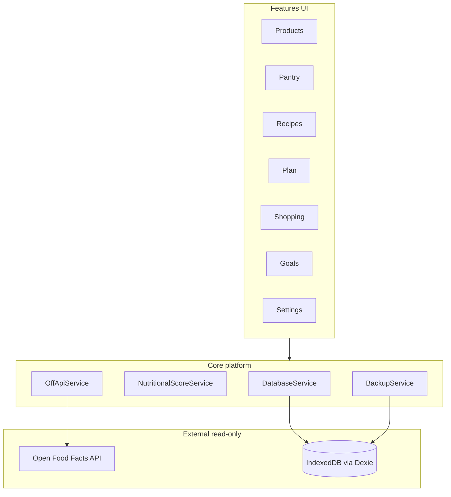
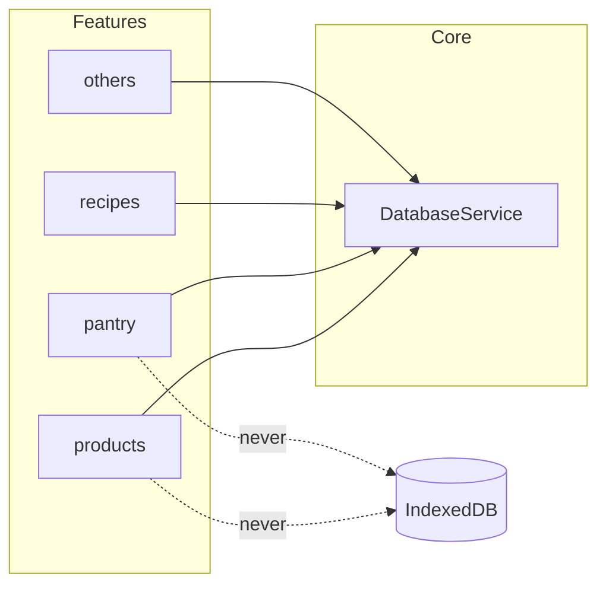
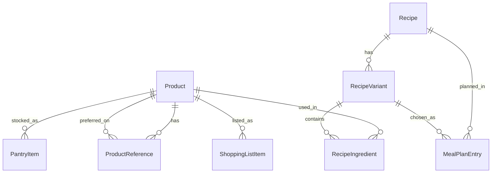

# Architecture Spine — Nutrition

## Design Paradigm

**Layered feature modules** — `core/` fournit la plateforme (Dexie, backup, scoring, OFF) ; chaque `features/*` porte UI + services métier de son domaine. Routes lazy par feature. État via **Angular signals + services** (pas de store global NgRx).



## Invariants & Rules

### AD-1 — Local-first sans backend applicatif [ADOPTED]

- **Binds:** all
- **Prevents:** Introduction silencieuse d’un serveur, sync cloud ou auth pour le MVP
- **Rule:** Aucune dépendance runtime vers un backend maison ; données utilisateur uniquement dans IndexedDB + export fichier local

### AD-2 — Porte unique IndexedDB [ADOPTED]

- **Binds:** all features, FR-3
- **Prevents:** Accès Dexie/IndexedDB dispersé dans les composants ou features croisées
- **Rule:** Seul `DatabaseService` (core) ouvre des tables Dexie ; features passent par des services qui appellent `DatabaseService`

### AD-3 — Catalogue deux niveaux : Product + ProductReference [ADOPTED]

- **Binds:** FR-5, FR-6, FR-7, FR-8, catalogue Excel
- **Prevents:** Un seul `products` avec brand/macros qui ne distingue pas générique vs SKU enseigne
- **Rule:** `Product` = identité cuisine (nom générique) ; `ProductReference` = SKU enseigne/marque (macros, barcode, prix, score) ; relation 1-N via `productReferences.productId`

### AD-4 — Liens métier sur le générique [ADOPTED]

- **Binds:** FR-9, FR-10, FR-12, FR-13, FR-19, FR-20, pantry, recipes, shopping
- **Prevents:** Recettes liées à un SKU Carrefour alors que l’utilisateur achète Auchan la semaine suivante
- **Rule:** `pantryItems`, `recipeIngredients`, `shoppingListItems` stockent `productId` uniquement — jamais `referenceId`

### AD-5 — Macros canoniques via référence préférée [ADOPTED]

- **Binds:** FR-13, FR-16, calcul macros recettes/plan
- **Prevents:** Macros recettes calculées sur une référence arbitraire ou agrégat non défini
- **Rule:** `Product.preferredReferenceId` pointe la source des macros pour 100 g ; calcul ingrédients recette lit cette référence ; si absente, UI bloque ou force le choix d’une référence préférée ; macros **variante** = somme ingrédients de la variante résolue (AD-14) ÷ portions de la recette

### AD-6 — Score nutritionnel stocké et recalculé au write [ADOPTED]

- **Binds:** catalogue, tri FR catalogue
- **Prevents:** Tri catalogue incohérent ou recalcul coûteux à chaque rendu
- **Rule:** `ProductReference.nutritionalScore` est persisté ; `NutritionalScoreService` recalcule à chaque create/update de macros (formule : 45 % prot/100 kcal + 35 % composition + 20 % densité calorique) ; index Dexie `nutritionalScore` pour tri/filtre MVP

### AD-7 — Enseignes recommandées ordonnées, principale = ref préférée [ADOPTED]

- **Binds:** catalogue, usage magasin
- **Prevents:** Champ `recommendedStore` divergent de la référence préférée
- **Rule:** Enseigne principale affichée = `store` de `preferredReferenceId` ; `Product.recommendedStores[]` liste ordonnée pour suggestions ; si vide, défaut = stores des refs triées par `nutritionalScore` décroissant puis `store`

### AD-8 — Open Food Facts lecture seule [ADOPTED]

- **Binds:** FR-7, FR-8
- **Prevents:** Envoi de données personnelles ou POST vers OFF
- **Rule:** `OffApiService` : GET `world.openfoodfacts.org/api/v2/product/` + barcode scanné ; cache mémoire session ; pas de persistance OFF hors `ProductReference`

### AD-9 — Scan barcode sur ProductReference [ADOPTED]

- **Binds:** FR-7, FR-8
- **Prevents:** Barcode sur Product générique quand plusieurs SKU existent
- **Rule:** Lookup scan par `productReferences.barcode` ; création OFF → `ProductReference` puis rattachement/création `Product` ; scan d’un barcode sur ref archivée → proposer restauration (aligné soft delete produit)

### AD-10 — Export/import JSON versionné [ADOPTED]

- **Binds:** FR-22, FR-23
- **Prevents:** Formats backup ad hoc ou non migrables
- **Rule:** `BackupService` exporte `schemaVersion`, toutes tables MVP ; chiffrement AES-GCM optionnel via Web Crypto ; import merge selon règles PRD addendum (products par barcode/name+brand, shopping manual skip en fusion)

### AD-11 — Grammes uniquement [ADOPTED]

- **Binds:** FR-5, FR-9, FR-13, FR-19
- **Prevents:** Unités ml/pièces sans conversion explicite
- **Rule:** Quantités stockées en grammes (`quantityG`) ; macros normalisées pour 100 g sur chaque référence

### AD-12 — UI sombre par défaut, mobile-first [ADOPTED]

- **Binds:** FR-2, FR-21, NFR usage magasin
- **Prevents:** Thème clair par défaut ou desktop-first en magasin
- **Rule:** `appSettings.theme` défaut `dark` ; Mode Courses : contraste élevé, pas d’animations distrayantes

### AD-13 — Recette famille + variantes MVP [ADOPTED]

- **Binds:** FR-12, FR-13, FR-14, substitutions/scale cuisine
- **Prevents:** Dupliquer des recettes quasi identiques ou mélanger substitution et scale dans un seul ingrédient figé
- **Rule:** `Recipe` = famille (titre, étapes partagées, `defaultPortions`, tags) ; `RecipeVariant` = déclinaison nommée (substitution produit ou scale quantités) ; `recipeIngredients` lient `variantId` + `productId` + `quantityG` ; chaque recette a au moins une variante ; `Recipe.defaultVariantId` obligatoire quand plusieurs variantes

### AD-14 — Choix de variante au plan ou au cook [ADOPTED]

- **Binds:** FR-16, FR-17, FR-19, synthèse macros, liste courses
- **Prevents:** Synthèse ou courses figées sur une variante alors que l’utilisateur cuisine une autre le jour J
- **Rule:** `mealPlanEntries` stocke `recipeId` + `recipeVariantId` nullable ; choix au **plan** (dimanche) ou au **cook** (jour J) en mettant à jour `recipeVariantId` ; variante **résolue** = `mealPlanEntry.recipeVariantId` sinon `Recipe.defaultVariantId` ; macros jour et génération liste courses utilisent la variante résolue ; UI cook permet changer la variante et recalcule la synthèse

### AD-15 — Notation perso sur variantes, pas de score macro recette MVP [ADOPTED]

- **Binds:** FR-12, FR-14, tri/filtre recettes
- **Prevents:** Score nutritionnel automatique sur recettes qui duplique le jugement macro déjà visible
- **Rule:** `RecipeVariant.rating` optionnel (étoiles 1–5) ; `Recipe` peut avoir `notes` sans score auto ; pas de `nutritionalScore` sur recette/variante au MVP — l’utilisateur arbitre via macros variantes vs restant journalier



## Consistency Conventions

| Concern | Convention |
| --- | --- |
| Naming (entities, files, interfaces) | Tables Dexie camelCase pluriel (`productReferences`) ; interfaces TypeScript PascalCase ; fichiers kebab-case |
| IDs | `crypto.randomUUID()` string |
| Dates | ISO 8601 UTC (`createdAt`, `updatedAt`, `deletedAt`, `date` plan) |
| Soft delete | `deletedAt` nullable ; listes filtrent `deletedAt == null` |
| Store enum | `carrefour`, `auchan`, `intermarche`, `leclerc`, `lidl`, `grandfrais`, `internet`, `other` — extensible |
| Priority enum | `green`, `yellow`, `gray` (map Excel 🟢🟡) |
| Error shapes | Services retournent `Result<T>` ou throw domain errors typés ; pas de strings libres dans UI |
| Langue UI | Français |
| State mutation | Services + signals ; pas de mutation Dexie hors `DatabaseService` |

## Stack

| Name | Version |
| --- | --- |
| TypeScript | 5.9.x (via Angular CLI) |
| Angular | 22.1.4 |
| @angular/service-worker | 22.1.4 |
| Dexie | 4.4.5 |
| @zxing/ngx-scanner | 22.0.1 |
| npm | 10.x |
| uv | 0.12.x (scripts BMAD) |

## Structural Seed

### Entités core (IndexedDB)

```
products
  id, name, category?, priority?, alternativeRemark?, notes?,
  preferredReferenceId?, recommendedStores[], deletedAt?, createdAt, updatedAt

productReferences
  id, productId, store, brand?, label, barcode?,
  kcalPer100g, proteinPer100g, fatPer100g, carbsPer100g, fiberPer100g?, saltPer100g?,
  ingredients?, price?, pricePerKg?, nutritionalScore, verdictLabel?, notes?,
  deletedAt?, createdAt, updatedAt

pantryItems       id, productId, quantityG, expiryDate?, location?, updatedAt
recipes           id, title, steps[], durationMin?, defaultPortions, tags[], notes?, defaultVariantId, createdAt, updatedAt
recipeVariants    id, recipeId, name, rating?, notes?, sortOrder?, createdAt
recipeIngredients id, variantId, productId, quantityG, slotLabel?
mealPlanEntries   id, date, slot, recipeId, recipeVariantId?
shoppingListItems id, productId, quantityG, checked, source, createdAt
macroGoals        id (singleton), kcal?, proteinG?, fatG?, carbsG?, fiberG?
appSettings       id (singleton), lastExportAt?, theme
```

Index Dexie clés : `productReferences.productId`, `productReferences.barcode`, `productReferences.nutritionalScore`, `productReferences.store`, `recipeVariants.recipeId`, `recipeIngredients.variantId`.

### ERD



### Arborescence source

```text
src/app/
  core/
    database/       # DatabaseService, Dexie schema, migrations
    backup/         # BackupService export/import/crypto
    scoring/        # NutritionalScoreService
    off-api/        # OffApiService
    layout/         # shell, bottom nav, dark theme
  features/
    products/       # catalogue générique + références + scan
    pantry/
    recipes/
    meal-plan/
    shopping-list/
    macro-goals/
    settings/
```

## Capability → Architecture Map

| Capability / Area | Lives in | Governed by |
| --- | --- | --- |
| PWA install / offline shell | `core` SW + `features` bootstrap | AD-1, AD-12 |
| Catalogue + scan + OFF | `features/products` + `core/off-api` | AD-3, AD-8, AD-9, AD-6 |
| Garde-manger | `features/pantry` | AD-4, AD-11 |
| Recettes + variantes + macros | `features/recipes` + `core/scoring` | AD-4, AD-5, AD-11, AD-13, AD-15 |
| Objectifs + synthèse | `features/macro-goals` + `features/meal-plan` | AD-5, AD-14 |
| Plan de repas + choix variante | `features/meal-plan` + `features/recipes` | AD-4, AD-14 |
| Liste courses + mode magasin | `features/shopping-list` | AD-4, AD-7, AD-12 |
| Backup | `features/settings` + `core/backup` | AD-10 |
| Tri catalogue par score | `features/products` | AD-6 |

## Deferred

- **Thème clair** — v1.1 via CSS variables si variables définies dès MVP (AD-12)
- **Sync cloud / multi-utilisateur** — post-MVP ; nécessite PRD explicite
- **Journal alimentaire repas-par-repas** — hors scope MVP PRD
- **Import automatique prix** — prix saisis manuellement sur référence ; pas d’API prix enseigne
- **Comparateur multi-enseignes avancé** — MVP = liste refs + tri score ; pas de vue matricielle complète type Excel
- **Génération IA recettes** — post-MVP
- **Score nutritionnel automatique sur recettes/variantes** — jugement macro manuel via macros variantes + restant journalier (AD-15)
- **Ingredient alternates[] sur un même slot** — MVP = variantes distinctes ; alternates runtime sans variante = v1.1
- **Repository pattern par entité** — si `DatabaseService` grossit, extraire repos sans changer AD-2
