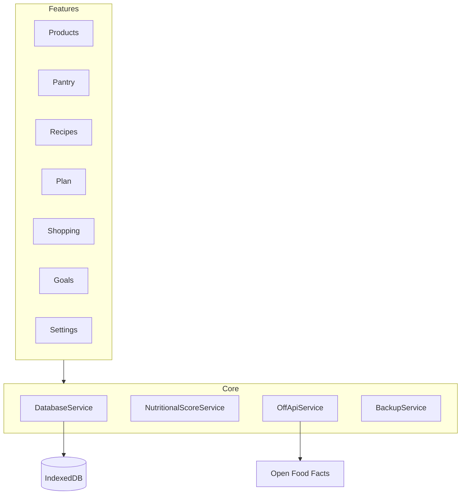
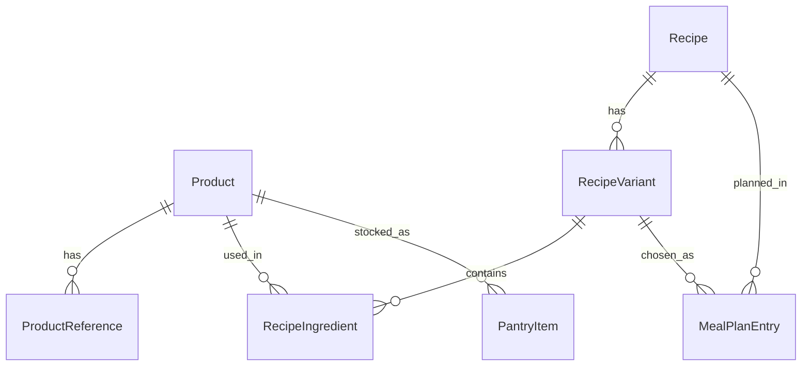
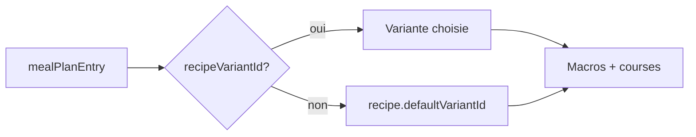

# Diagrammes — Nutrition MVP

> Complément visuel. Contrat normatif : `ARCHITECTURE-SPINE.md`.

## Couches applicatives

```mermaid
flowchart TB
  subgraph features [Features]
    Products
    Pantry
    Recipes
    Plan
    Shopping
    Goals
    Settings
  end
  subgraph core [Core]
    DatabaseService
    NutritionalScoreService
    OffApiService
    BackupService
  end
  features --> core
  DatabaseService --> IDB[(IndexedDB)]
  OffApiService --> OFF[Open Food Facts]
```

## Catalogue + recettes

```mermaid
erDiagram
  Product ||--o{ ProductReference : has
  Recipe ||--o{ RecipeVariant : has
  RecipeVariant ||--o{ RecipeIngredient : contains
  Product ||--o{ RecipeIngredient : used_in
  Recipe ||--o{ MealPlanEntry : planned_in
  RecipeVariant ||--o{ MealPlanEntry : chosen_as
  Product ||--o{ PantryItem : stocked_as
```

## Résolution variante (plan / cook)

```mermaid
flowchart LR
  Entry[mealPlanEntry] --> Q{recipeVariantId?}
  Q -->|oui| V[Variante choisie]
  Q -->|non| D[recipe.defaultVariantId]
  V --> Macros[Macros + courses]
  D --> Macros
```
